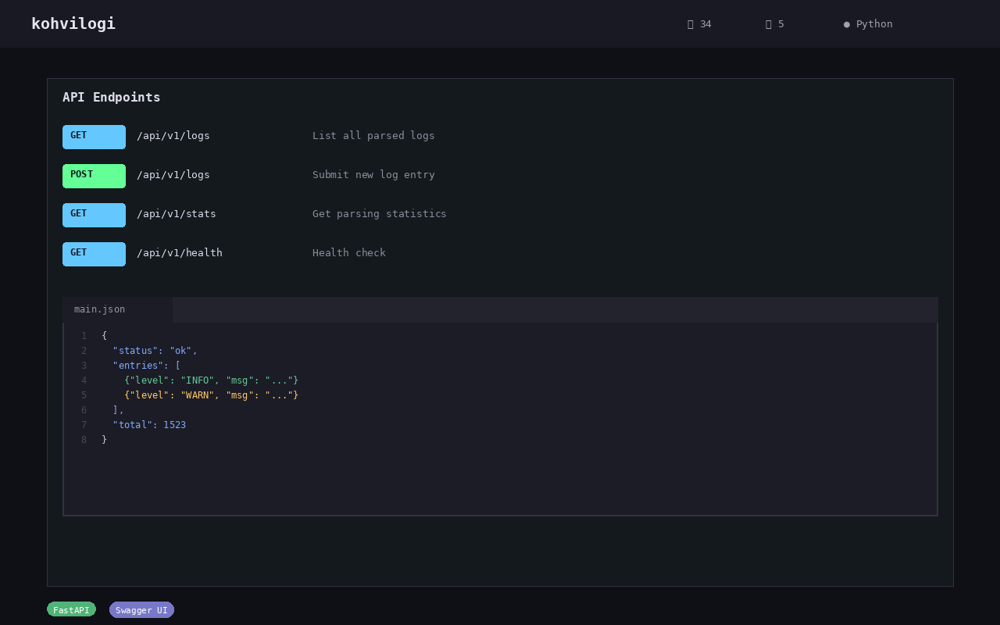

# Kohvilogi

**Log coffee to the map & journal** — track your coffee consumption with statistics and world map visualization.

[](https://github.com/stennu718/kohvilogi/actions/workflows/tests.yml)
[](https://opensource.org/licenses/MIT)
[](https://www.python.org/downloads/)
[](https://github.com/stennu718/kohvilogi/releases)
[](https://github.com/stennu718/kohvilogi/pkgs/container/kohvilogi)



## Demo


## Try it

☕ **[Try Live Demo](https://stennu718.github.io/kohvilogi/demo/)** — log coffee, view stats, explore the API

Or run locally:
```bash
pip install -r requirements.txt
uvicorn app.main:app --reload
```

## Features

- **Coffee logging** — record coffee type, amount, location, country, GPS coordinates
- **Statistics** — daily, weekly, monthly consumption analytics, streak tracking
- **World map** — interactive map with coffee regions (27 regions)
- **Coffee passport** — track which countries you've had coffee in
- **PWA support** — installable, offline-capable
- **Sharing** — QR code summary sharing

## API Documentation

Interactive API docs available at `/docs` (Swagger UI) when running the server.

| Endpoint | Method | Description |
|----------|--------|-------------|
| `/add` | POST | Log a coffee entry |
| `/list` | GET | List all entries |
| `/stats` | GET | Consumption statistics |
| `/map` | GET | Map visualization data |

## Quick Start

```bash
# Clone
git clone https://github.com/stennu718/kohvilogi.git
cd kohvilogi

# Setup
python -m venv .venv
source .venv/bin/activate
pip install -r requirements.txt

# Run
uvicorn app.main:app --reload
# Available at: http://localhost:8000
# API docs: http://localhost:8000/docs
```

## API Endpoints

| Endpoint | Description |
|----------|-------------|
| `GET /` | Homepage |
| `POST /add` | Add coffee entry |
| `POST /delete/{id}` | Delete entry |
| `GET /stats` | Monthly statistics |
| `GET /map` | World map data |
| `GET /api/streak` | Streak + quick stats |
| `GET /api/world` | World data |
| `GET /health` | Health check |

## Tech Stack

- **Backend:** FastAPI + SQLite
- **Frontend:** Jinja2 templates, PWA
- **Database:** SQLite (aiosqlite)
- **Deploy:** Docker

## Tests

```bash
pytest tests/ -v
```

## Screenshots

| Dashboard | Map | Stats |
|-----------|-----|-------|
|  |  |  |

## Architecture

```
kohvilogi/
├── app/
│   ├── __init__.py      # App package init
│   ├── main.py          # FastAPI application entry point
│   ├── routes.py        # API & page route definitions
│   ├── database.py      # SQLite async database layer (aiosqlite)
│   └── constants.py     # Configuration constants
├── templates/
│   ├── index.html       # Main dashboard (log entries, quick stats)
│   ├── stats.html       # Detailed consumption statistics
│   └── world.html       # Interactive world map & coffee passport
├── tests/
│   ├── test_unit.py     # Unit tests
│   ├── test_integration.py  # Integration tests
│   ├── test_e2e.py      # End-to-end user journey tests
│   ├── test_security.py # Security & input validation tests
│   ├── conftest.py      # Pytest fixtures
│   └── factories.py     # Test data factories
├── docs/                # Screenshots & documentation
├── scripts/             # CI test scripts
├── .github/workflows/   # CI Actions (tests, Docker)
├── Dockerfile           # Multi-stage Docker build
├── docker-compose.yml   # Local Docker setup
├── pyproject.toml       # Project config & dependencies
├── requirements.txt     # Pinned dependencies
└── railway.toml         # Railway deployment config
```

### Tech Stack

- **Backend:** Python 3.11+ / FastAPI with async support
- **Database:** SQLite via aiosqlite (async)
- **Frontend:** Jinja2 server-side templates, Tailwind CSS, vanilla JS
- **PWA:** Service worker, offline caching, installable web app
- **Testing:** pytest + pytest-cov (99% coverage target), pytest-xdist for parallel execution
- **CI/CD:** GitHub Actions (test pipeline + Docker build/push to GHCR)
- **Deployment:** Docker, Railway, GHCR (`ghcr.io/stennu718/kohvilogi`)
- **API Docs:** Auto-generated Swagger UI at `/docs`

### Design Decisions

- **Server-side rendering** over a SPA — keeps the app simple and lightweight
- **SQLite** — single-file database perfect for single-user deployment, no external service needed
- **Async throughout** — FastAPI + aiosqlite ensure non-blocking I/O
- **PWA-first** — service worker caches all pages for offline use

## Contributing

See [CONTRIBUTING.md](CONTRIBUTING.md) for details.

## License

MIT
